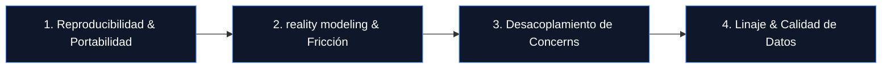

# QUANT PROJECT GROWTH PRINCIPLES — THE ROADMAP TO INSTITUTIONAL
**Date:** 2026-05-18
**Project:** Systematic Infrastructure Professionalization
**Security Status:** READ-ONLY AUDIT & COMPILATION — NO CODE OR REPOSITORY MUTATION

---

## 1. El Diagnóstico Maestro

El estado actual del repositorio `alerasnik97-tech/bottrading` revela una mentalidad muy superior al promedio retail: existe una taxonomía formal de promoción (`STRATEGY_PROMOTION_POLICY.md`), protocolos de rechazo fuera de muestra (`OOS_REJECTION_PROTOCOL.md`) y disciplina de gates de gobernanza.

Sin embargo, el proyecto sufre de un desacoplamiento crítico con los estándares institucionales de software e infraestructura:
1.  **Dependencia del Entorno Local:** Rutas absolutas vinculadas a la máquina del operador (`C:\Users\alera\Desktop\...`), carpetas con espacios en el nombre, y falta de contenedores reproducibles.
2.  ** reality modeling Ausente:** Backtests que asumen ejecución perfecta, sin simular deslizamiento dinámico (slippage), latencia de red, rechazos de órdenes de MT5, o ensanchamiento dinámico de spreads.
3.  **Falta de Desacoplamiento:** El motor de señales (Alpha), la gestión de riesgo (Risk) y la ejecución física (Execution) suelen estar mezclados en scripts monolíticos en lugar de capas independientes protegidas.

Para superar este gap, establecemos los siguientes **Principios de Crecimiento Cuantitativo**, inspirados en las mejores arquitecturas de código abierto de nivel institucional.

---

## 2. Lecciones de los Benchmarks Institucionales

```
+-----------------------------------------------------------------------------------+
|                              BENCHMARKS INSTITUCIONALES                           |
+----------------------+------------------------------------------------------------+
| Plataforma           | Lección Arquitectónica Core                                |
+----------------------+------------------------------------------------------------+
| QuantConnect LEAN    | Desacoplamiento de componentes (Alpha -> Portfolio ->     |
|                      | Risk -> Execution) y Reality Modeling estricto de fills.   |
+----------------------+------------------------------------------------------------+
| NautilusTrader       | Alto rendimiento event-driven, uso de Parquet Data Catalog |
|                      | para linaje de datos y contenedores Docker reproducibles.  |
+----------------------+------------------------------------------------------------+
| Freqtrade            | Tooling automatizado contra lookahead bias, hiper-         |
|                      | optimización reproducible y telemetría estructurada.       |
+----------------------+------------------------------------------------------------+
| Hummingbot           | Orquestación multi-bot basada en Docker, dashboards en     |
|                      | tiempo real y control de riesgo a nivel de API/Gateway.    |
+----------------------+------------------------------------------------------------+
```

---

## 3. Los 4 Pilares del Crecimiento Quant



### PILAR 1: REPRODUCIBILIDAD Y PORTABILIDAD INDUSTRIAL
*El código debe correr exactamente igual en tu computadora local, en un servidor VPS remoto, en Kaggle o en un runner de CI/CD de GitHub Actions.*

*   **Acción 1: Eliminación de Paths Locales.** Queda terminantemente prohibido escribir rutas de archivo que dependan del usuario del sistema (p. ej. `C:\Users\alera\...`). Toda ruta debe resolverse dinámicamente mediante `pathlib` relativa al `PROJECT_ROOT` o configurarse vía variables de entorno.
*   **Acción 2: Docker-First Environment.** Empaquetar el laboratorio de investigación y el motor de ejecución en contenedores Docker. Esto elimina el clásico problema de "en mi máquina funciona" y garantiza que las dependencias de Python, librerías matemáticas y timezones (DST) sean 100% estables.

---

### PILAR 2: REALITY MODELING (SIMULACIÓN DE LA FRICCIÓN OPERATIVA)
*Un backtest que no modela la imperfección del mercado es un ejercicio de autoengaño cuantitativo.*

*   **Acción 1: Modelos de Slippage Dinámico.** Implementar un modelo de deslizamiento que incremente los costos de transacción en función del tamaño del lote, la hora del día (baja liquidez) y la volatilidad instantánea (ATR).
*   **Acción 2: Simulación de Latencia y Fills Parciales.** Modelar el retraso de red (p. ej. 50ms-200ms de latencia MT5). En EURUSD intradía, una latencia pequeña puede desplazar el precio de entrada y convertir un trade ganador en perdedor.

---

### PILAR 3: DESACOPLAMIENTO DE CONCERNS (ARQUITECTURA DE CAPAS)
*Las señales de entrada no deben conocer las reglas de asignación de capital, y los ejecutores no deben conocer la lógica de las señales.*

Inspirado en QuantConnect LEAN, el flujo de procesamiento de una orden debe pasar por capas desacopladas:

1.  **Alpha Module:** Emite "Insights" direccionales (UP, DOWN, FLAT) basándose únicamente en la lógica técnica/matemática de la estrategia.
2.  **Portfolio Construction Module:** Recibe los insights de múltiples alphas y determina la asignación de capital (tamaño de lote óptimo) basándose en correlaciones y presupuestos de riesgo.
3.  **Risk Management Module (Pre-Trade Risk):** Valida de forma independiente si las órdenes propuestas violan las reglas de FTMO (drawdown diario, pérdida acumulada, horario prohibido, control de "fat-finger"). **Actúa como un firewall insalvable.**
4.  **Execution Module:** Envía físicamente las órdenes a MetaTrader 5 y gestiona las confirmaciones, re-intentos y políticas de llenado (fills).

---

### PILAR 4: LINAJE Y CALIDAD DE DATOS (DATA GOVERNANCE)
*La calidad del alpha está directamente limitada por la integridad de los datos históricos.*

*   **Acción 1: Parquet Data Catalog.** Abandonar gradualmente los archivos CSV planos para datos de ticks históricos. Adoptar formatos columnares optimizados como Parquet, estructurados bajo un catálogo de datos centralizado (Data Vault).
*   **Acción 2: Manifests y Checksums.** Cada dataset en `05_MARKET_DATA_VAULT` debe acompañarse de un manifiesto JSON con metadatos descriptivos (proveedor, rango de fechas, timezone original, lógica de normalización) y un checksum MD5 inmutable. Si el checksum cambia, el backtest debe fallar inmediatamente para evitar contaminación silenciosa.

---

## 4. Hoja de Ruta Tecnológica para el Owner (Timeline de Profesionalización)

### Fase 1: Saneamiento del Software (Corto Plazo)
- Refactorizar el paquete `research_lab` para eliminar dependencias relativas frágiles.
- Implementar controles pre-trade risk rígidos e independientes para la cuenta MT5.
- Adoptar estándares PEP 8, linter (Ruff) y verificador de tipos (Mypy) en la integración continua.

### Fase 2: Plataformización (Mediano Plazo)
- Migrar la ingesta y almacenamiento de datos tick-by-tick a un formato Parquet con catálogo dinámico.
- Desarrollar un simulador event-driven básico para evaluar señales M1/M5 con slippage dinámico.
- Implementar un panel de control y alertas operativas vía canal de Telegram o Slack utilizando instrumentación estructurada de logs.

### Fase 3: Escala Institucional (Largo Plazo)
- Dockerización completa de todas las piezas para despliegues masivos en la nube.
- Transición a APIs estandarizadas (p. ej. FIX Protocol si se migra a brokers institucionales o cuentas de fondeo mayores).
- Automatización del ledger de experimentos para auditar la probabilidad de overfitting en cada campaña de optimización.
