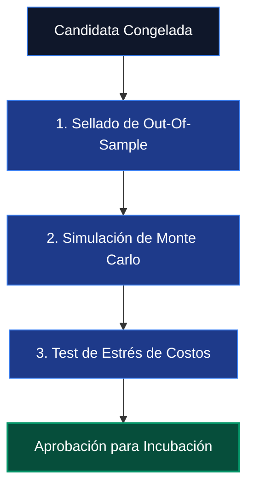

# RISKS, OVERFITTING, AND SELF-DECEPTION — THE QUANT SAFETY MANUAL
**Date:** 2026-05-18
**Project:** Methodological Safety Protocol
**Security Status:** READ-ONLY AUDIT & COMPILATION — NO CODE OR REPOSITORY MUTATION

---

## 1. El Enemigo Número Uno: El Autoengaño Cuantitativo

En el trading cuantitativo, el mayor peligro no es perder dinero por un fallo de red o un broker deshonesto; el mayor peligro es **crear una máquina de autoengaño**. 

Una computadora tiene la capacidad de probar millones de combinaciones de parámetros en segundos. Si buscas lo suficiente, siempre encontrarás un conjunto de reglas que produjo una curva de rendimiento perfecta en los datos históricos del pasado. Sin embargo, ese resultado no representa un "borde" o ventaja real de mercado (Edge); es simplemente un **espejismo estadístico (sobreajuste)** que se destruirá catastróficamente en el momento en que se exponga al mercado real.

Este documento establece los **Protocolos de Seguridad Metodológica** obligatorios para blindar el laboratorio de investigación contra los sesgos cognitivos y los fallos de software que causan falsos positivos en el backtesting.

---

## 2. Los Sesgos Cuantitativos y Sus Mitigaciones

```
+-----------------------------------------------------------------------------------+
|                            AMENAZAS METODOLÓGICAS Y FILTROS                       |
+----------------------+------------------------------------------------------------+
| Amenaza              | Efecto Catastrófico                                        |
+----------------------+------------------------------------------------------------+
| Overfitting          | Curva perfecta en Train; pérdida total inmediata en Real.  |
+----------------------+------------------------------------------------------------+
| Data Leakage         | Normalizaciones que usan información del futuro.           |
+----------------------+------------------------------------------------------------+
| Lookahead Bias       | Lógicas de señal que miran velas futuras de forma oculta.  |
+----------------------+------------------------------------------------------------+
| Selection Bias       | Publicar solo los backtests ganadores e ignorar los fallidos.|
+----------------------+------------------------------------------------------------+
```

### AMENAZA 1: OVERFITTING (SOBREAJUSTE)
*Ocurre cuando el algoritmo aprende el "ruido" específico de los datos históricos del pasado en lugar de la señal estructural subyacente.*

*   **Lógica del Sesgo:** Si una estrategia tiene 5 parámetros optimizables (p. ej. tamaño de canal Donchian, multiplicador ATR, umbral RSI, hora de inicio y hora de fin), existen más de 10,000 combinaciones posibles. Al probarlas todas sobre el mismo dataset de TRAIN, la "mejor" combinación ganadora es puramente casualidad.
*   **Procedimiento de Seguridad:**
    1.  **Parámetros Congelados:** Al evaluar ideas sourced (como MR-01 o VE-01), se prohíbe terminantemente realizar barridos (sweeps) masivos de parámetros para "mejorar" el rendimiento. Los parámetros deben congelarse en los valores recomendados por el autor original de la especificación.
    2.  **Complejidad Penalizada:** A menor número de condiciones lógicas en una estrategia, mayor es su robustez. Si una idea requiere más de tres filtros independientes para funcionar, debe ser rechazada de inmediato (`REJECT_OVERFIT_RISK`).

---

### AMENAZA 2: DATA LEAKAGE (FILTRACIÓN DE DATOS)
*Se produce cuando la información del futuro se filtra de forma silenciosa hacia el pasado a través del procesamiento de datos.*

*   **Lógica del Sesgo:** Un ejemplo clásico es normalizar una variable (como el volumen o el ATR) utilizando la media o desviación estándar del **dataset completo** (incluyendo el futuro), en lugar de usar únicamente una ventana rodante hacia atrás (rolling backward-only).
*   **Procedimiento de Seguridad:**
    1.  **Causalidad en Normalizaciones:** Cualquier cálculo de percentiles, medias móviles o desviaciones estándar debe utilizar una sintaxis estrictamente retrospectiva (p. ej. en Pandas usando `.rolling(window).mean()` o ventanas de expansión backward).
    2.  **Aislamiento de Timezones:** El timezone pipeline debe ser auditado de forma fail-closed para asegurar que los timestamps UTC se conviertan al huso horario de Nueva York (NY) de forma idéntica en el cargador de datos del backtester y en el motor de ejecución en vivo.

---

### AMENAZA 3: LOOKAHEAD BIAS (SESGO DE ANTICIPACIÓN)
*Consiste en utilizar información que no estaba disponible físicamente en el momento en que se debió tomar la decisión de entrada.*

*   **Lógica del Sesgo:** Clasificar un día de mercado como "Trend Day" (Día de Tendencia) utilizando datos de la sesión completa, y gatillar una compra en un retroceso por la mañana basándose en esa clasificación. En el backtest esto da retornos perfectos, pero en la realidad es imposible saber por la mañana si el día completo cerrará como tendencia.
*   **Procedimiento de Seguridad:**
    1.  **Corte Operativo Estricto:** Si una estrategia requiere clasificar el régimen del día (p. ej. TP-01), el periodo de observación debe cerrarse por completo a una hora fija (p. ej. $\le$ 09:30 NY). Ningún dato posterior a esa hora puede participar en la lógica del gatillo de entrada.
    2.  **Tests de Desplazamiento Temporal:** Introducir pruebas unitarias sintácticas que desplacen las señales una vela hacia adelante para verificar que el resultado del backtest no se degrade artificialmente o muestre comportamientos anómalos que revelen lookahead oculto.

---

## 3. Protocolos de Verificación Obligatorios

Antes de que cualquier estrategia candidata sea aprobada para pasar del entorno de investigación (`03_RESEARCH_LAB`) a la incubación controlada (`02_INCUBATION_STAGING`), el Research Synthesis Officer debe certificar que ha superado las siguientes tres pruebas de robustez:



### PROTOCOLO 1: AISLAMIENTO ABSOLUTO DEL OUT-OF-SAMPLE (OOS)
- Los datos históricos del periodo **2015 – 2024** se definen como la zona exclusiva de entrenamiento (TRAIN) e investigación inicial.
- Los datos del periodo **2025 – 2026** constituyen el **Holdout Sellado (OOS)**.
- Se prohíbe terminantemente correr backtests o explorar parámetros sobre el Holdout 2025/2026 durante la fase de desarrollo. Si un investigador accede a esos datos antes de congelar formalmente la estrategia, el dataset se considera "contaminado" y la estrategia queda descalificada para siempre.

### PROTOCOLO 2: SIMULACIÓN DE MONTE CARLO (RESAMPLING DE TRADES)
- La secuencia de operaciones obtenida en el backtest de TRAIN debe someterse a una prueba de Monte Carlo con al menos **5,000 iteraciones**, desordenando aleatoriamente la secuencia de retornos.
- **Criterio de Aceptación:** La probabilidad de que el drawdown acumulado bajo la secuencia alterada supere el límite del 10% (regla FTMO) debe ser **menor al 1%**.

### PROTOCOLO 3: TEST DE ESTRÉS DE COSTOS Y SPREAD
- Evaluar el rendimiento de la estrategia aplicando tres perfiles de costes de transacción progresivos:
  1.  **Perfil Base:** Spread de 0.5 pips + comisión estándar.
  2.  **Perfil Conservador:** Spread de 1.5 pips + comisión.
  3.  **Perfil de Estrés:** Spread de 3.5 pips (simulando rollover de las 17:00 NY o volatilidad moderada).
- **Criterio de Aceptación:** El Ratio de Sharpe de la estrategia bajo el Perfil Conservador no debe degradarse más de un **30%** frente al Perfil Base, y debe permanecer positivo bajo el Perfil de Estrés. Si el Sharpe se vuelve negativo con 1.5 pips de spread, la estrategia es inviable en el mercado real y queda rechazada de inmediato.
