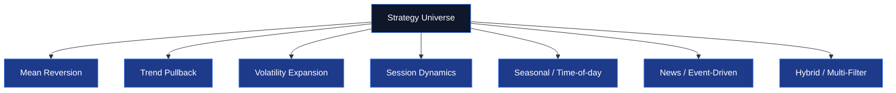

# ESTRATEGIAS POSIBLES MASTER INDEX — TAXONOMICAL MAP
**Date:** 2026-05-18
**Project:** Systematic Infrastructure Professionalization — Strategy Master Index
**Security Status:** READ-ONLY AUDIT & COMPILATION — NO CODE OR REPOSITORY MUTATION

---

## 1. Introducción al Mapa Taxonómico

Este índice maestro organiza las **20 estrategias cuantitativas de origen externo** junto con **10 ideas cuantitativas adicionales de nivel institucional** (completando las 30 ideas reglamentarias) para operar intradía el par EURUSD (07:00-19:00 NY). Cada modelo ha sido mapeado a su respectiva categoría, evaluando su utilidad real, riesgos operacionales y prioridad relativa para el laboratorio de trading.

---

## 2. Clasificación por Categorías Cuantitativas



### CATEGORÍA A: MEAN REVERSION (MR)
*Sistemas que asumen el agotamiento del impulso del precio y su posterior regreso a un punto medio de equilibrio.*

1.  **VWAP Reversion con Z-Score (Strategy 5):**
    *   **Ubicación:** [EURUSD_Strategy_Research_Report.md:L711](file:///C:/Users/alera/Desktop/Bot/BOT%20DE%20TRADING%20ultimo/03_RESEARCH_LAB/strategy_research_intake/external_research_20260518/ESTRATEGIAS_POSIBLES/EURUSD_Strategy_Research_Report.md#L711)
    *   **Resumen:** Captura desviaciones estadísticas de $\pm2$ desviaciones estándar sobre el VWAP acumulado desde las 07:00 NY, filtrando la fuerza con un Z-score $\le -1.5$ o $\ge 1.5$.
    *   **Familia:** Mean Reversion.
    *   **Utilidad para EURUSD:** **Extrema**. EURUSD intradía presenta un comportamiento altamente mean-reverting en un 80% de las sesiones americanas post-apertura.
    *   **Prioridad Preliminar:** **ALTA (Priority A)**
    *   **Riesgos:** Pérdidas severas en días con tendencias unidireccionales persistentes (Trend Days).

2.  **RSI(2) Mean-Adjusted Reversion (Strategy 6):**
    *   **Ubicación:** [EURUSD_Strategy_Research_Report.md:L864](file:///C:/Users/alera/Desktop/Bot/BOT%20DE%20TRADING%20ultimo/03_RESEARCH_LAB/strategy_research_intake/external_research_20260518/ESTRATEGIAS_POSIBLES/EURUSD_Strategy_Research_Report.md#L864)
    *   **Resumen:** Reversión desde niveles extremos de RSI(2) (sobreventa $\le 10$, sobrecompra $\ge 90$) confirmada cuando el precio está desalineado de la EMA20 M5.
    *   **Familia:** Mean Reversion.
    *   **Utilidad para EURUSD:** **Media**. Útil para scalping intradía de alta frecuencia, pero altamente sensible a costos y spreads.
    *   **Prioridad Preliminar:** **MEDIA (Priority B)**
    *   **Riesgos:** Generación excesiva de señales falsas en micro-tendencias fuertes.

3.  **Statistical Reversion from Multi-Day MA (Strategy 7):**
    *   **Ubicación:** [EURUSD_Strategy_Research_Report.md:L981](file:///C:/Users/alera/Desktop/Bot/BOT%20DE%20TRADING%20ultimo/03_RESEARCH_LAB/strategy_research_intake/external_research_20260518/ESTRATEGIAS_POSIBLES/EURUSD_Strategy_Research_Report.md#L981)
    *   **Resumen:** Reversión hacia la SMA de 20 días calculada en M15 cuando el precio intradía se desvía más de 2 desviaciones estándar ($\pm2\sigma$).
    *   **Familia:** Mean Reversion.
    *   **Utilidad para EURUSD:** **Media**. Ofrece un anclaje robusto de varios días, útil para evitar micro-ruido.
    *   **Prioridad Preliminar:** **MEDIA (Priority B)**
    *   **Riesgos:** Parámetros fijos de stops amplios (50 pips) que no se adaptan bien a volatilidades dinámicas intradía.

4.  **Bollinger Bands "Double Tap" Divergence (Strategy 8):**
    *   **Ubicación:** [EURUSD_Strategy_Research_Report.md:L1136](file:///C:/Users/alera/Desktop/Bot/BOT%20DE%20TRADING%20ultimo/03_RESEARCH_LAB/strategy_research_intake/external_research_20260518/ESTRATEGIAS_POSIBLES/EURUSD_Strategy_Research_Report.md#L1136)
    *   **Resumen:** Reversión a la media tras toques consecutivos en un intervalo de 15-30 minutos en las bandas de Bollinger M5, confirmados por divergencia en RSI M15.
    *   **Familia:** Mean Reversion.
    *   **Utilidad para EURUSD:** **Alta**. Combina estructura dinámica de precio (bandas) con debilidad del momentum (RSI).
    *   **Prioridad Preliminar:** **MEDIA (Priority B)**
    *   **Riesgos:** Alta dificultad de programar la divergencia RSI de forma puramente causal sin lookahead bias.

5.  **London Close Mean Reversion (Strategy 17):**
    *   **Ubicación:** [EURUSD_Strategy_Research_Report.md:L2508](file:///C:/Users/alera/Desktop/Bot/BOT%20DE%20TRADING%20ultimo/03_RESEARCH_LAB/strategy_research_intake/external_research_20260518/ESTRATEGIAS_POSIBLES/EURUSD_Strategy_Research_Report.md#L2508)
    *   **Resumen:** Reversión hacia el VWAP diario durante el cierre de la sesión europea (09:30-16:30 NY), cuando el precio se desvía $\ge 5$ pips del valor promedio.
    *   **Familia:** Mean Reversion.
    *   **Utilidad para EURUSD:** **Extrema**. Explota el flujo real institucional de liquidación de fin de sesión en Europa.
    *   **Prioridad Preliminar:** **ALTA (Priority A)**
    *   **Riesgos:** Requiere un feed de datos VWAP preciso y normalización de timezone UTC/NY estricta.

---

### CATEGORÍA B: TREND PULLBACK / CONTINUATION (TP)
*Estrategias de seguimiento de tendencia que buscan incorporarse al movimiento dominante tras correcciones dinámicas.*

6.  **Institutional EMA Pullback (Strategy 12):**
    *   **Ubicación:** [EURUSD_Strategy_Research_Report.md:L1746](file:///C:/Users/alera/Desktop/Bot/BOT%20DE%20TRADING%20ultimo/03_RESEARCH_LAB/strategy_research_intake/external_research_20260518/ESTRATEGIAS_POSIBLES/EURUSD_Strategy_Research_Report.md#L1746)
    *   **Resumen:** Entradas a favor de la tendencia M15 (EMA50 > EMA200) tras retrocesos a la EMA50 en M5, con stop loss y targets ajustados por ATR.
    *   **Familia:** Trend Pullback.
    *   **Utilidad para EURUSD:** **Alta**. Las EMAs institucionales actúan de forma recurrente como soportes dinámicos en mercados con tendencia fluida.
    *   **Prioridad Preliminar:** **ALTA (Priority A)**
    *   **Riesgos:** Alto número de pérdidas consecutivas si el mercado entra en fases laterales prolongadas.

7.  **Trend Pullback ADX-Fib 61.8% (Strategy 13):**
    *   **Ubicación:** [EURUSD_Strategy_Research_Report.md:L1924](file:///C:/Users/alera/Desktop/Bot/BOT%20DE%20TRADING%20ultimo/03_RESEARCH_LAB/strategy_research_intake/external_research_20260518/ESTRATEGIAS_POSIBLES/EURUSD_Strategy_Research_Report.md#L1924)
    *   **Resumen:** Entradas en el retroceso del 61.8% de Fibonacci del impulso intradiario en M5, condicionado a que el ADX en M15 sea $>25$.
    *   **Familia:** Trend Pullback.
    *   **Utilidad para EURUSD:** **Media**. Lógica clásica muy respetada, pero con alta subjetividad en la definición algorítmica de los "Impulses/Swings".
    *   **Prioridad Preliminar:** **MEDIA (Priority B)**
    *   **Riesgos:** Riesgo extremo de lookahead bias al programar los algoritmos de detección de picos y valles en tiempo real.

8.  **Breakout-Retest Structural Pullback (Strategy 14):**
    *   **Ubicación:** [EURUSD_Strategy_Research_Report.md:L2076](file:///C:/Users/alera/Desktop/Bot/BOT%20DE%20TRADING%20ultimo/03_RESEARCH_LAB/strategy_research_intake/external_research_20260518/ESTRATEGIAS_POSIBLES/EURUSD_Strategy_Research_Report.md#L2076)
    *   **Resumen:** Ruptura de máximos/mínimos estructurales de la sesión anterior en M5, seguida de entrada en el retesteo exacto ($\pm3$ pips) en velas M1.
    *   **Familia:** Trend Pullback.
    *   **Utilidad para EURUSD:** **Alta**. Los breakouts-retest estructurales capturan la participación del dinero inteligente.
    *   **Prioridad Preliminar:** **ALTA (Priority A)**
    *   **Riesgos:** Latencia de ejecución crítica y ensanchamiento de spreads en momentos del breakout.

---

### CATEGORÍA C: VOLATILITY EXPANSION / BREAKOUT (VE)
*Modelos que explotan la transición de periodos de baja volatilidad (acumulación) a rangos de alta volatilidad (expansión).*

9.  **ORB Volatility ATR Threshold (Strategy 1):**
    *   **Ubicación:** [EURUSD_Strategy_Research_Report.md:L74](file:///C:/Users/alera/Desktop/Bot/BOT%20DE%20TRADING%20ultimo/03_RESEARCH_LAB/strategy_research_intake/external_research_20260518/ESTRATEGIAS_POSIBLES/EURUSD_Strategy_Research_Report.md#L74)
    *   **Resumen:** Ruptura del rango de apertura (07:00-09:00 NY) filtrada por un umbral mínimo de ATR(14) en M15 al cierre de las 09:00 NY.
    *   **Familia:** Volatility Expansion.
    *   **Utilidad para EURUSD:** **Extrema**. Se acopla perfectamente a los flujos direccionales que se inician en la apertura de Wall Street.
    *   **Prioridad Preliminar:** **ALTA (Priority A)**
    *   **Riesgos:** Falsas rupturas en días laterales con baja liquidez general o sin noticias catalizadoras.

10. **Bollinger Band Squeeze & ADX (Strategy 2):**
    *   **Ubicación:** [EURUSD_Strategy_Research_Report.md:L232](file:///C:/Users/alera/Desktop/Bot/BOT%20DE%20TRADING%20ultimo/03_RESEARCH_LAB/strategy_research_intake/external_research_20260518/ESTRATEGIAS_POSIBLES/EURUSD_Strategy_Research_Report.md#L232)
    *   **Resumen:** Compresión extrema de las bandas de Bollinger M5 ($<20\%$ del ancho promedio reciente) seguida de ruptura direccional con ADX M15 $>25$.
    *   **Familia:** Volatility Expansion.
    *   **Utilidad para EURUSD:** **Alta**. Muy común en la pre-apertura americana antes de grandes eventos de volumen.
    *   **Prioridad Preliminar:** **ALTA (Priority A)**
    *   **Riesgos:** Alto peligro de sobreajuste al calibrar el umbral del squeeze.

11. **Volatility Expansion Keltner Breakout (Strategy 3):**
    *   **Ubicación:** [EURUSD_Strategy_Research_Report.md:L409](file:///C:/Users/alera/Desktop/Bot/BOT%20DE%20TRADING%20ultimo/03_RESEARCH_LAB/strategy_research_intake/external_research_20260518/ESTRATEGIAS_POSIBLES/EURUSD_Strategy_Research_Report.md#L409)
    *   **Resumen:** Ruptura y cierre fuera del Keltner Channel (20 EMA, 10 ATR, 1.5 multiplier) durante la superposición Londres-NY (07:00-11:00 NY).
    *   **Familia:** Volatility Expansion.
    *   **Utilidad para EURUSD:** **Alta**. Canales adaptables a la volatilidad local reducen señales erráticas en comparación con canales fijos.
    *   **Prioridad Preliminar:** **ALTA (Priority A)**
    *   **Riesgos:** Rendimiento plano en fases de rango extendido.

12. **Donchian Breakout + VWAP Confirmation (Strategy 4):**
    *   **Ubicación:** [EURUSD_Strategy_Research_Report.md:L548](file:///C:/Users/alera/Desktop/Bot/BOT%20DE%20TRADING%20ultimo/03_RESEARCH_LAB/strategy_research_intake/external_research_20260518/ESTRATEGIAS_POSIBLES/EURUSD_Strategy_Research_Report.md#L548)
    *   **Resumen:** Ruptura de canal Donchian de 20 periodos M5 confirmada cuando el precio cierra del lado correcto del VWAP intrabarra y su pendiente es favorable.
    *   **Familia:** Volatility Expansion.
    *   **Utilidad para EURUSD:** **Alta**. Añadir la confirmación de la pendiente volumétrica del VWAP reduce de forma notable los fallos estructurales.
    *   **Prioridad Preliminar:** **ALTA (Priority A)**
    *   **Riesgos:** Requiere alta fidelidad en los datos tick/volumen para el VWAP de 1 minuto.

13. **NY Mid-Day Breakout (Strategy 18):**
    *   **Ubicación:** [EURUSD_Strategy_Research_Report.md:L2623](file:///C:/Users/alera/Desktop/Bot/BOT%20DE%20TRADING%20ultimo/03_RESEARCH_LAB/strategy_research_intake/external_research_20260518/ESTRATEGIAS_POSIBLES/EURUSD_Strategy_Research_Report.md#L2623)
    *   **Resumen:** Ruptura del rango estrecho acumulado durante la hora del almuerzo de Wall Street (11:30-12:00 NY) operando entre las 12:00 y 14:00 NY.
    *   **Familia:** Volatility Expansion / Time-of-day.
    *   **Utilidad para EURUSD:** **Alta**. EURUSD consolida con alta regularidad a esa hora y expande volatilidad al reanudarse los flujos de la tarde.
    *   **Prioridad Preliminar:** **ALTA (Priority A)**
    *   **Riesgos:** Slippages elevados al mediodía debido a menor liquidez en los libros.

---

### CATEGORÍA D: SESSION DYNAMICS & FAKEOUTS (SD)
*Estrategias de gobernanza especial que operan fallos o rupturas en los límites de sesiones geográficas.*

14. **London Session H/L Breakout (Strategy 9):**
    *   **Ubicación:** [EURUSD_Strategy_Research_Report.md:L1290](file:///C:/Users/alera/Desktop/Bot/BOT%20DE%20TRADING%20ultimo/03_RESEARCH_LAB/strategy_research_intake/external_research_20260518/ESTRATEGIAS_POSIBLES/EURUSD_Strategy_Research_Report.md#L1290)
    *   **Resumen:** Ruptura de máximos/mínimos de la sesión de Londres (03:00-12:00 UTC) filtrada por rango estrecho de la hora previa (pre-sesión $\le0.3\times$ ATR).
    *   **Familia:** Session Dynamics.
    *   **Utilidad para EURUSD:** **Alta**, pero con alta competencia institucional.
    *   **Prioridad Preliminar:** **MEDIA (Priority B)**
    *   **Riesgos:** **DIFERIDA**. Presenta un alto riesgo de solapamiento de señales con el motor de breakouts de la sesión NY.

15. **Asian Range Liquidity Fakeout (Strategy 10):**
    *   **Ubicación:** [EURUSD_Strategy_Research_Report.md:L1413](file:///C:/Users/alera/Desktop/Bot/BOT%20DE%20TRADING%20ultimo/03_RESEARCH_LAB/strategy_research_intake/external_research_20260518/ESTRATEGIAS_POSIBLES/EURUSD_Strategy_Research_Report.md#L1413)
    *   **Resumen:** Falso breakout del máximo o mínimo de la consolidación asiática (22:00-07:00 NY), entrando en la reversión inmediata en M1.
    *   **Familia:** Session Dynamics / Fakeouts.
    *   **Utilidad para EURUSD:** **Alta**, pero compartiendo la misma hipótesis que la estrategia activa.
    *   **Prioridad Preliminar:** **DIFERIDA (Priority D)**
    *   **Riesgos:** **HIGH CORRELATION RISK WITH MANIPULANTE**. Se prohíbe su codificación para evitar duplicidad teórica y drawdowns coincidentes en cuenta real.

16. **NY Opening Reversal (Initial Balance Failure) (Strategy 11):**
    *   **Ubicación:** [EURUSD_Strategy_Research_Report.md:L1562](file:///C:/Users/alera/Desktop/Bot/BOT%20DE%20TRADING%20ultimo/03_RESEARCH_LAB/strategy_research_intake/external_research_20260518/ESTRATEGIAS_POSIBLES/EURUSD_Strategy_Research_Report.md#L1562)
    *   **Resumen:** Ruptura fallida del Initial Balance (07:00-08:30 NY), gatillando reversión cuando el precio cierra dentro del rango en M5 antes de las 12:00.
    *   **Familia:** Session Dynamics / Fakeouts.
    *   **Utilidad para EURUSD:** **Alta**.
    *   **Prioridad Preliminar:** **DIFERIDA (Priority D)**
    *   **Riesgos:** Alta correlación teórica con la captura de liquidez fractal de `Manipulante`.

---

### CATEGORÍA E: NEWS & EVENT-DRIVEN (ED)
*Estrategias que explotan la ineficiencia temporal del mercado tras la inyección abrupta de información macroeconómica.*

17. **Post-News Volatility Reversion (Strategy 15):**
    *   **Ubicación:** [EURUSD_Strategy_Research_Report.md:L2219](file:///C:/Users/alera/Desktop/Bot/BOT%20DE%20TRADING%20ultimo/03_RESEARCH_LAB/strategy_research_intake/external_research_20260518/ESTRATEGIAS_POSIBLES/EURUSD_Strategy_Research_Report.md#L2219)
    *   **Resumen:** Reversión de la volatilidad extrema post-noticia tras confirmación de rechazo M1 (spike $>2\times$ ATR_pre) hacia la media de precios.
    *   **Familia:** Event-Driven / Reversion.
    *   **Utilidad para EURUSD:** **Alta**. EURUSD sobrerreacciona de forma sistemática en eventos NFP o de tasas, estabilizándose posteriormente.
    *   **Prioridad Preliminar:** **DIFERIDA (Priority D)**
    *   **Riesgos:** Riesgo extremo de ruina si el evento fundamental desencadena un cambio de tendencia macroestructural duradero (unidirectional trend). Requiere base de datos económica sincronizada en milisegundos.

18. **Post-News Momentum Continuation (Strategy 16):**
    *   **Ubicación:** [EURUSD_Strategy_Research_Report.md:L2354](file:///C:/Users/alera/Desktop/Bot/BOT%20DE%20TRADING%20ultimo/03_RESEARCH_LAB/strategy_research_intake/external_research_20260518/ESTRATEGIAS_POSIBLES/EURUSD_Strategy_Research_Report.md#L2354)
    *   **Resumen:** Espera una estabilización de 15 minutos post-noticia (desviación estándar $\le0.5\times$ ATR_1m) para unirse al momentum direccional.
    *   **Familia:** Event-Driven / Trend.
    *   **Utilidad para EURUSD:** **Alta**. Captura la "segunda ola" de flujos institucionales tras el desequilibrio de la noticia.
    *   **Prioridad Preliminar:** **DIFERIDA (Priority D)**
    *   **Riesgos:** Spreads extremadamente amplios en brokers minoristas o cuentas FTMO durante el tramo de entrada.

---

### CATEGORÍA F: HYBRIDS & MULTI-FILTER (HY)
*Estrategias que combinan múltiples indicadores matemáticos y lógicos en un intento de filtrar el micro-ruido.*

19. **Hybrid Volatility-Filtered Trend Following (Strategy 19):**
    *   **Ubicación:** [EURUSD_Strategy_Research_Report.md:L2785](file:///C:/Users/alera/Desktop/Bot/BOT%20DE%20TRADING%20ultimo/03_RESEARCH_LAB/strategy_research_intake/external_research_20260518/ESTRATEGIAS_POSIBLES/EURUSD_Strategy_Research_Report.md#L2785)
    *   **Resumen:** Seguimiento de tendencia mediante SuperTrend M5 filtrado por volatilidad mínima ATR M5 y alineación de tendencia en M15.
    *   **Familia:** Hybrid.
    *   **Utilidad para EURUSD:** **Baja-Media**.
    *   **Prioridad Preliminar:** **MEDIA (Priority C)**
    *   **Riesgos:** Alto riesgo de overfitting al calibrar múltiples optimizadores (SuperTrend, ATR, Higher Timeframe filters).

20. **Hybrid M15 Trend + VWAP MR (Strategy 20):**
    *   **Ubicación:** [EURUSD_Strategy_Research_Report.md:L2923](file:///C:/Users/alera/Desktop/Bot/BOT%20DE%20TRADING%20ultimo/03_RESEARCH_LAB/strategy_research_intake/external_research_20260518/ESTRATEGIAS_POSIBLES/EURUSD_Strategy_Research_Report.md#L2923)
    *   **Resumen:** Reversión rápida al VWAP intradía en velas M1 filtrada por la dirección de tendencia M15 (MA10 > MA30).
    *   **Familia:** Hybrid.
    *   **Utilidad para EURUSD:** **Media**.
    *   **Prioridad Preliminar:** **MEDIA (Priority C)**
    *   **Riesgos:** Alta frecuencia de operaciones (15-30 por día) que viola directamente el límite diario recomendado del owner (máximo 3 trades/día) y devora comisiones.

---

## 3. Inventario de Decisiones de Gobernanza (Resumen de Exclusiones)

```
+-------------------------------------------------------------------------------------------------------+
|                                     INVENTARIO DE EXCLUSIONES Y RIESGOS                               |
+----+-----------------------+---------------------------------------+----------------------------------+
| ID | Estrategia            | Clasificación de Riesgo               | Causa Técnica de la Decisión     |
+----+-----------------------+---------------------------------------+----------------------------------+
| 10 | Asian Fakeout         | HIGH_CORRELATION_RISK_NOT_PRIORITY    | Mismo trigger lógico/estructural|
|    |                       |                                       | de Manipulante.                  |
+----+-----------------------+---------------------------------------+----------------------------------+
| 11 | NY Initial Balance    | HIGH_CORRELATION_RISK_NOT_PRIORITY    | Captura falsas rupturas de       |
|    |                       |                                       | extremos (solapamiento directo). |
+----+-----------------------+---------------------------------------+----------------------------------+
| 15 | Post-News Reversion   | REQUIRES_NEW_DATA_AND_COMPLEX_INFRA   | Requiere base de datos macro y   |
|    |                       |                                       | feed de ticks ultra-rápido.      |
+----+-----------------------+---------------------------------------+----------------------------------+
| 20 | M15 Trend + VWAP MR   | VIOLATES_OPERATIONAL_RESTRICTIONS     | Frecuencia insostenible (15-30   |
|    |                       |                                       | trades/día). Máximo es 3.        |
+----+-----------------------+---------------------------------------+----------------------------------+
```
