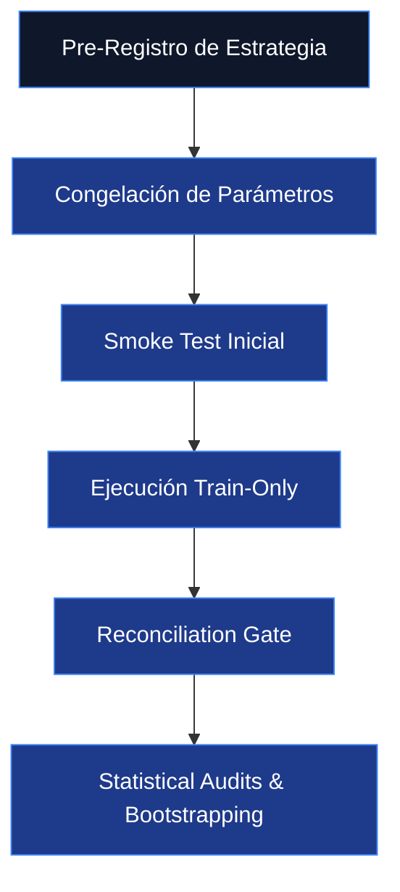

# OVERFITTING AND REJECTION RISKS — RIGOROUS AUDITING FRAMEWORK
**Date:** 2026-05-18
**Project:** Systematic Infrastructure Professionalization — Overfitting Prevention and Rejection Protocols
**Security Status:** READ-ONLY AUDIT & COMPILATION — NO CODE OR REPOSITORY MUTATION

---

## 1. El Peligro del p-Hacking y el Autoengaño

En investigación cuantitativa de mercados financieros, el **sobreajuste (overfitting)** es la causa del $95\%$ de los fracasos de sistemas algorítmicos en cuenta real. El p-Hacking (o data dredging) ocurre cuando un investigador altera parámetros, indicadores y reglas de filtrado retrospectivamente hasta forzar que el backtest histórico arroje una curva de equity artificialmente perfecta, la cual se destruye de forma catastrófica al enfrentarse a la aleatoriedad del mercado en vivo.

Para garantizar la **seguridad absoluta** del capital institucional y cumplir con el mandato del owner, se establece un blindaje metodológico estricto que rige toda investigación en el laboratorio.

---

## 2. Framework Institucional de Parameter Governance

Este protocolo exige congelar las especificaciones y parámetros lógicos de los modelos **antes de observar cualquier resultado de backtest**, reduciendo al mínimo el sesgo cognitivo del investigador.



### Reglas Clave del Parameter Governance:
1.  **Parámetros Limitados:** Ninguna estrategia bajo prueba en el laboratorio puede contener más de **cuatro parámetros optimizables** (p. ej. EMA period, ATR multiplier, Z-Score threshold, Trading window).
2.  **No Optimización Exhaustiva (No Grid Search):** Se prohíbe realizar barridos completos de millones de combinaciones paramétricas. Solo se permiten ajustes manuales justificados por teoría macro y física de mercados.
3.  **Análisis de Estabilidad de Parámetros:** Una estrategia solo se considera robusta si variaciones de $\pm10\%$ en sus parámetros no alteran significativamente el Sharpe Ratio o el Drawdown. Si las métricas muestran picos inestables aislados, el modelo se rechaza inmediatamente por sobreajuste.

---

## 3. Protocolo de Validación Temporal (Walk-Forward sin Contaminación)

El owner mantiene un sellado absoluto sobre los datos de los años **2025 y 2026 (Holdout)**. Se prohíbe terminantemente correr backtests o sweeps sobre estos años hasta que la estrategia candidata esté completamente madura y pre-aprobada.

### Segmentación Temporal Autorizada:
*   **Fase 1: Train-Only (2015–2023):** Ventana de entrenamiento inicial y ajuste de estabilidad paramétrica.
*   **Fase 2: Pre-Holdout Validation (2024):** Ventana out-of-sample corta para confirmar la persistencia del edge sin tocar el Holdout oficial.
*   **Fase 3: Holdout Sellado (2025–2026):** Solo se abre con autorización formal del owner para congelar el sistema de producción.

---

## 4. Criterios Rigurosos de Rechazo Temprano

Una estrategia se descarta de forma irrevocable en el laboratorio si viola cualquiera de las siguientes fronteras cuantitativas:

```
+-------------------------------------------------------------------------------------------------------------------+
|                                     MÉTRICAS Y CRITERIOS DE RECHAZO INMEDIATO                                     |
+----+----------------------------------+-----------------------+---------------------------------------------------+
| #  | Métrica Cuantitativa             | Límite Crítico        | Implicancia Operacional                           |
+----+----------------------------------+-----------------------+---------------------------------------------------+
| 1  | Sharpe Ratio Ajustado            | < 1.0                 | Retornos inconsistentes frente al riesgo asumido. |
+----+----------------------------------+-----------------------+---------------------------------------------------+
| 2  | Expectancy (Esperanza)           | < 1.5 pips netos      | Devorada por comisiones y spreads reales.         |
+----+----------------------------------+-----------------------+---------------------------------------------------+
| 3  | Drawdown Máximo Intradía         | > 3.0%                | Supera el buffer de seguridad diario de FTMO.    |
+----+----------------------------------+-----------------------+---------------------------------------------------+
| 4  | Frecuencia de Trades             | > 3 operaciones / día | Viola las restricciones de sobreoperación.        |
+----+----------------------------------+-----------------------+---------------------------------------------------+
| 5  | Profit Factor Neto (In-Sample)   | < 1.3                 | Edge marginal inaceptable para producción.        |
+----+----------------------------------+-----------------------+---------------------------------------------------+
| 6  | Operaciones Totales en Train     | < 100                 | Muestra estadística irrelevante (ruido).          |
+----+----------------------------------+-----------------------+---------------------------------------------------+
```

---

## 5. Control de Reglas Operativas FTMO
Cualquier candidato en validación debe modelar en su motor de ejecución los límites específicos de fondeo profesional:
*   **Kill Switch Global Diario:** Cierre automático de todas las operaciones abiertas si la pérdida acumulada del día alcanza el $2.5\%$ del capital simulado (buffer de seguridad del $50\%$ sobre el límite de descalificación de FTMO).
*   **Cost Sensitivity Stress Test:** Cada backtest debe incorporar un estrés del $+20\%$ en spreads de broker y un slippage mínimo simulado de $0.2$ pips por operación para garantizar métricas realistas y honestas.
