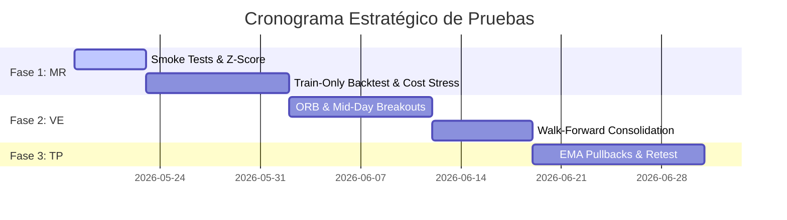

# RECOMMENDED TESTING SEQUENCE — DEVELOPMENT ROADMAP
**Date:** 2026-05-18
**Project:** Systematic Infrastructure Professionalization — Actionable Roadmap and Testing Pipeline
**Security Status:** READ-ONLY AUDIT & COMPILATION — NO CODE OR REPOSITORY MUTATION

---

## 1. Secuenciación de Pruebas y Diversificación

Para garantizar la agilidad máxima sin comprometer la seguridad ni la calidad, se establece una secuencia ordenada de desarrollo y testeo en el laboratorio. Las estrategias se abordan en oleadas según su nivel de complejidad técnica, requerimientos de datos locales y su capacidad de diversificar al portafolio activo.



---

## 2. Secuencia Recomendada por Familias y Modelos

1.  **OLEADA 1: MEAN REVERSION (MR):**
    *   *Candidatos:* `MR17` (London Close VWAP), `MR05` (VWAP Z-Score).
    *   *Objetivo:* Obtener una base sólida de descorrelación con el algoritmo activo.
2.  **OLEADA 2: VOLATILITY EXPANSION (VE):**
    *   *Candidatos:* `VE01` (ORB Volatility), `VE18` (NY Mid-Day Volatility Expansion).
    *   *Objetivo:* Explotar la direccionalidad limpia y robustecer el portafolio en días de tendencia (Trend Days).
3.  **OLEADA 3: TREND PULLBACK (TP):**
    *   *Candidatos:* `TP12` (Trend Pullback Institutional EMA), `TP14` (Breakout-Retest Structural).
    *   *Objetivo:* Capturar la fuerza del momentum diario en Nueva York tras correcciones dinámicas.

---

## 3. Checklist Detallada por Fases de Desarrollo

### A. Checklist de Smoke Testing (Día 1–2 por modelo)
- [ ] **Aislamiento absoluto:** Confirmar que el script base corre de forma aislada, sin importar módulos del core de producción de forma errónea.
- [ ] **Validación de Datos:** Confirmar la lectura correcta de barras Parquet M1 y M5 en el Data Vault local.
- [ ] **Integridad de Parámetros:** Verificar que los parámetros lógicos (ATR period, VWAP window) estén congelados en el encabezado del archivo.
- [ ] **Límite de Operaciones:** Verificar mediante asserts lógicos que el algoritmo no ejecute más de 3 operaciones diarias bajo ninguna circunstancia.
- [ ] **No Lookahead Assert:** Comprobar que el modelo solo use información del pasado inmediato (barras cerradas) para tomar decisiones.

### B. Checklist de Train-Only Backtesting (Día 3–7 por modelo)
- [ ] **Ejecución In-Sample (2015-2023):** Correr el backtest estricto sobre la ventana autorizada de entrenamiento.
- [ ] **Calibración de Fricciones:** Integrar comisiones de broker y spread dinámico realista en el cálculo neto.
- [ ] **Stress Test de Spreads:** Simular un aumento del $+20\%$ en spreads medios y registrar degradación de métricas.
- [ ] **Análisis de Sensibilidad:** Alterar parámetros dinámicos $\pm10\%$ y verificar estabilidad del Sharpe Ratio.
- [ ] **Registro de Manifest:** Generar y almacenar el manifest de la corrida con hashes y rowcounts firmados.

### C. Checklist de Walk-Forward y Validación (Día 8–12 por modelo)
- [ ] **Ventana de Validación (2024):** Ejecutar el modelo congelado out-of-sample sin alterar parámetros.
- [ ] **Test de Correlación:** Comparar retornos diarios del candidato contra los de `Manipulante` y calcular coeficiente de correlación de Pearson.
- [ ] **Simulación FTMO Rule compliance:** Verificar cumplimiento de drawdowns máximos diarios del $2.5\%$.
- [ ] **Firma del Gate Report:** Compilar los resultados en un reporte institucional para el owner.

---

## 4. El Proceso de Aprobación Gate-by-Gate

```
+-------------------------------------------------------------------------------------------------------------------+
|                                          FRAMEWORK DE PUERTAS DE CALIDAD (GATES)                                  |
+--------+----------------------------+---------------------------------------+-------------------------------------+
| Gate   | Nombre del Gate            | Requisito Mínimo                      | Acción Autorizada                   |
+--------+----------------------------+---------------------------------------+-------------------------------------+
| Gate 1 | Signal Validation          | Smoke Test aprobado, no lookahead     | Permitido iniciar backtest Train.   |
+--------+----------------------------+---------------------------------------+-------------------------------------+
| Gate 2 | Economic Calibrator        | Sharpe > 1.0 en Train con costos      | Permitido iniciar validación 2024.  |
+--------+----------------------------+---------------------------------------+-------------------------------------+
| Gate 3 | Portfolio Harmonizer       | Correlación Pearson < 0.40           | Permitido pre-aprobar en Staging.   |
+--------+----------------------------+---------------------------------------+-------------------------------------+
| Gate 4 | Frozen Validation          | Aprobación explícita del owner        | Permitido abrir Holdout 2025/2026.  |
+--------+----------------------------+---------------------------------------+-------------------------------------+
```

---

## 5. Próximos Pasos Inmediatos Sugeridos para el Owner

1.  **Aprobación del Roadmap:** Revisar y firmar este roadmap metodológico de desarrollo.
2.  **Habilitación de Smoke Tests:** Programar los scripts base de `MR17` (London Close VWAP) y `VE01` (ORB-ATR) en una subcarpeta aislada en `03_RESEARCH_LAB/` para verificar la normalización del VWAP sin contaminar el core de producción.
3.  **Monitoreo del Sweep:** Preparar la infraestructura de Kaggle Cloud para el sweep de validación in-sample de los modelos de Oleada 1.
