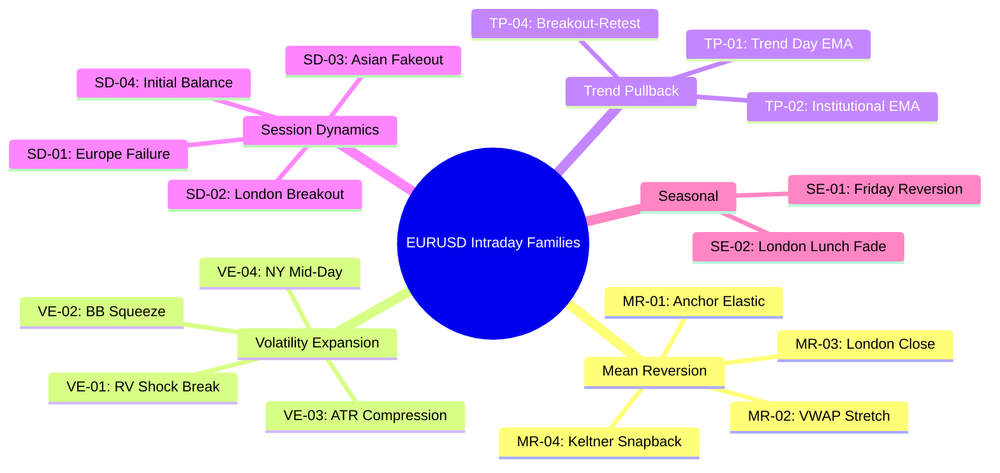

# STRATEGY FAMILY CANDIDATE MAP — PORTFOLIO COHERENCE
**Date:** 2026-05-18
**Project:** EURUSD Intraday Research (NY Session)
**Security Status:** READ-ONLY AUDIT & COMPILATION — NO CODE OR REPOSITORY MUTATION

---

## 1. Fundamento del Mapa de Familias

Para construir un laboratorio cuantitativo profesional, es inadmisible acumular estrategias sueltas basadas en optimizaciones de parámetros. Cada estrategia debe ser asignada a una **Familia Taxonómica** clara con una hipótesis de comportamiento de mercado explicable. 

Además, dado que el bot ya cuenta con una estrategia core activa de tipo barrido de liquidez (`Manipulante`), debemos auditar con extremo rigor la **correlación cruzada esperada**. Si agregamos estrategias de la misma familia (Session Dynamics / Fakeouts), corremos el riesgo de multiplicar el riesgo de cola y experimentar drawdowns coincidentes que violen los límites de pérdida diaria de FTMO (5% equity).

---

## 2. Taxonomía de Familias Cuantitativas (EURUSD Intraday)

---

## 3. Desglose Detallado por Familia de Estrategia

### FAMILIA A: MEAN REVERSION (MR)
*Explota la tendencia de los precios financieros a regresar a una media estadística o anclaje de equilibrio tras una desviación extrema provocada por desbalances transitorios de flujo.*

*   **Lógica de Mercado:** Los flujos institucionales intradía a menudo empujan el precio fuera de su zona de valor temporal (VWAP/TWAP). Sin noticias de alto impacto que justifiquen una revaluación fundamental, los creadores de mercado y los arbitrajistas de varianza tienden a devolver el precio a su ancla.
*   **Aplicabilidad EURUSD Intraday:** **Muy Alta**. EURUSD es el par de divisas más líquido del mundo y muestra un comportamiento altamente mean-reverting en ausencia de catalizadores macro.
*   **Ventana Horaria NY Probable:** 07:00 – 19:00 NY (Especialmente activa tras la apertura del mercado americano y durante la tarde).
*   **Correlación Esperada contra `Manipulante`:** **BAJA**. `Manipulante` opera capturando barridos y expansiones de liquidez extrema en extremos fractales, mientras que MR entra en desvíos continuos sin requerir que ocurra un sweep en los niveles H1.
*   **Presupuesto de Datos:** OHLCV estándar en barras de M1/M5.
*   **Riesgo de Overfitting:** **Bajo-Medio**. Mitigado al fijar anclajes temporales objetivos (p. ej. apertura de NY 07:00).

---

### FAMILIA B: VOLATILITY EXPANSION (VE)
*Identifica contracciones extremas en el rango de precios para entrar a favor del movimiento cuando la volatilidad se expande bruscamente (momentum breakout).*

*   **Lógica de Mercado:** Los periodos de baja volatilidad (compresión) representan equilibrio transitorio o acumulación institucional. Cuando el precio rompe los límites de este rango con un volumen inusualmente alto, indica el inicio de una nueva tendencia intradía impulsada por flujos unidireccionales.
*   **Aplicabilidad EURUSD Intraday:** **Alta**. El solapamiento de las sesiones de Londres y Nueva York (08:00 – 11:30 NY) produce contracciones previas seguidas de expansiones muy limpias y direccionales.
*   **Ventana Horaria NY Probable:** 08:00 – 12:00 NY.
*   **Correlación Esperada contra `Manipulante`:** **BAJA**. Son sistemas de continuación y seguimiento de tendencia (Trend Following), lo cual diversifica de manera natural los sistemas de contra-tendencia o reversión de liquidez.
*   **Presupuesto de Datos:** M5/M15 OHLCV + Volumen relativo o ticks negociados.
*   **Riesgo de Overfitting:** **Medio-Alto**. Alto peligro si se optimizan demasiado los percentiles de compresión (p. ej. BB width o umbrales de compresión ATR). Requiere ventanas rodantes estrictamente rodantes hacia atrás.

---

### FAMILIA C: TREND PULLBACK (TP)
*Busca incorporarse a una tendencia intradía establecida aprovechando retrocesos técnicos a zonas de soporte dinámico (medias móviles o anclajes de precio medio).*

*   **Lógica de Mercado:** En días de tendencia fuerte (Trend Days), las instituciones no persiguen el precio; esperan a que el par retroceda a zonas de valor promedio (p. ej. EMA20 o VWAP) para acumular posiciones en la dirección del flujo dominante.
*   **Aplicabilidad EURUSD Intraday:** **Alta** en días con catalizadores claros o flujos direccionales sostenidos tras la sesión europea.
*   **Ventana Horaria NY Probable:** 09:30 – 16:00 NY (Clasificación del día de tendencia a las 09:30; entradas posteriores).
*   **Correlación Esperada contra `Manipulante`:** **BAJA**. La continuación de tendencia a favor del flujo de mediano plazo no interfiere con los barridos de extremos de `Manipulante`.
*   **Presupuesto de Datos:** M5/M15 OHLCV.
*   **Riesgo de Overfitting:** **Medio**. El principal riesgo es el "lookahead bias" al clasificar si un día es tendencia antes de que termine el periodo de observación. **Solución:** Clasificar estrictamente con datos $\le$ 09:30 NY y operar solo de forma posterior.

---

### FAMILIA D: SESSION DYNAMICS & FAKEOUTS (SD)
*Explota los límites de las sesiones geográficas (Asia, Londres, Nueva York), asumiendo que los primeros intentos de ruptura suelen ser falsos extremos diseñados para atrapar liquidez minorista.*

*   **Lógica de Mercado:** El dinero inteligente empuja el par ligeramente por encima/debajo de los máximos de la sesión de Londres o del Initial Balance para activar las órdenes de stop de los traders de breakout. Una vez capturada esa liquidez, revierten la cotización en dirección contraria.
*   **Aplicabilidad EURUSD Intraday:** **Muy Alta**, pero altamente competitiva.
*   **Ventana Horaria NY Probable:** 07:00 – 11:30 NY.
*   **Correlación Esperada contra `Manipulante`:** **EXTREMADAMENTE ALTA**. La subfamilia de fakeouts de extremos y fallos estructurales comparte la misma base causal de `Manipulante` (barrido de extremos fractales + patrón de confirmación).
*   **Riesgo de Portafolio:** Si se implementan simultáneamente múltiples estrategias de esta familia, un solo día de breakout real sostenido (sin fallo) provocará drawdowns coincidentes en todas las sub-estrategias, violando el control de riesgo FTMO.
*   **Presupuesto de Datos:** Requiere datos de cotización de alta precisión (Bid/Ask/Ticks) para evaluar la excursión milimétrica fuera del canal.
*   **Gobernanza:** **DIFERIDAS**. Se prohíbe su codificación inmediata hasta que se defina un **Presupuesto de Correlación** formal y se certifiquen los datos de alta precisión en el vault.

---

### FAMILIA E: SEASONAL & ESTACIONALES (SE)
*Aprovecha patrones estacionales intradía recurrentes vinculados a comportamientos institucionales fijos (p. ej. cierres de libros, almuerzos de traders o liquidación de contratos).*

*   **Lógica de Mercado:** Los grandes bancos y fondos tienen rutinas operativas estrictas. Por ejemplo, a las 12:00-13:00 NY (hora del almuerzo en Wall Street), la liquidez se reduce drásticamente, haciendo que los breakouts de ese tramo fallen con alta probabilidad (London Lunch Fade). Los viernes por la tarde (a partir de las 14:00 NY), el cierre de libros semanales provoca reversiones sistemáticas.
*   **Aplicabilidad EURUSD Intraday:** **Alta**, pero con baja frecuencia de trading.
*   **Ventana Horaria NY Probable:** Horarios específicos (p. ej. Viernes > 14:00 NY o diario de 11:30 a 13:00 NY).
*   **Correlación Esperada contra `Manipulante`:** **BAJA**. La señal se activa por factores estacionales y de reloj, no por la estructura técnica del precio en extremos fractales.
*   **Presupuesto de Datos:** M15/M30 OHLCV estándar.
*   **Riesgo de Overfitting:** **Medio-Alto** (riesgo de "data mining" si se buscan patrones horarios sin justificación microestructural). Debe limitarse a las ventanas documentadas por la literatura cuantitativa clásica.

---

## 4. Matriz Comparativa y Diagnóstico de Viabilidad

| Familia | Código | Dificultad de Software | Riesgo Overfitting | Riesgo Muestra Chica | Compatibilidad FTMO | Correlación Manipulante | Estado de Gobernanza |
| :--- | :--- | :--- | :--- | :--- | :--- | :--- | :--- |
| **Mean Reversion** | MR | **Baja** | Bajo | Bajo | **Alta** (Time stops limpios) | **Baja** | Aprobada para Signal Test |
| **Volatility Expansion** | VE | **Media** | Medio-Alto | Medio | **Media** (Altamente sensible a spread) | **Baja** | Aprobada tras Spec Refinement |
| **Trend Pullback** | TP | **Media** | Medio | Medio | **Alta** (A favor del flujo) | **Baja** | Aprobada tras Spec Refinement |
| **Session Dynamics** | SD | **Alta** | Medio | Bajo | **Baja** (Por correlación coincidente) | **Extremadamente Alta** | **Diferida por Alta Correlación** |
| **Seasonal** | SE | **Baja** | Medio | Alto (Pocas muestras) | **Alta** | **Baja** | Aprobada para Idea Stage |

---

## 5. Recomendación de Presupuesto de Correlación para el Portafolio

Para garantizar la supervivencia del laboratorio bajo las reglas de control de drawdowns de FTMO, se establece el siguiente límite operativo:

> [!IMPORTANT]
> **REGLA DE CONVERGENCIA DE CARTERA:**
> 1. El coeficiente de correlación lineal histórica ($R$) entre los retornos diarios de cualquier estrategia candidata y `Manipulante` en el periodo de TRAIN **no debe superar el 0.35**.
> 2. Se prohíbe la activación simultánea en real/demo de más de **dos estrategias** que pertenezcan a la subfamilia de *Liquidity Sweeps* o *Session Extremes Fades* (Session Dynamics).
> 3. Si una estrategia de Session Dynamics (p. ej. SD-01) es promovida, debe compartir obligatoriamente un **límite de pérdida diario consolidado** con `Manipulante`, reduciendo a la mitad el tamaño del lote de ambas para evitar la ruina de la cuenta.
