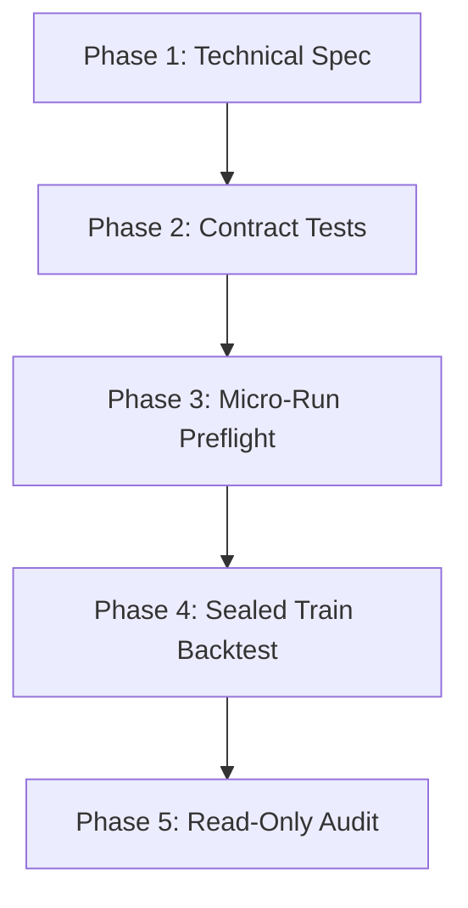

# FIRST BATCH EXECUTION PLAN V1

This document outlines the systematic, documentation-driven implementation and testing protocol for the pre-registered first batch strategies (`BO01`, `MR02`, `MR03`, `LS01`, `LS02`).

---

## 1. Implementation Phasing
Every pre-registered strategy must progress sequentially through the following 5 phases:



-   **Phase 1: Technical Specification:** Translate the pre-registration template into precise mathematical rules, indicator definitions, and timezone handling.
-   **Phase 2: Targeted Contract Tests:** Write targeted unit tests verifying no-lookahead features, TZ offsets, contract borders, and trade-trigger invariants in `03_RESEARCH_LAB/research_lab/tests`.
-   **Phase 3: Micro-Run Preflight:** Execute a fast 10-day dry-run to confirm that order entries, stops, limits, spreads, commissions, and telemetry log correctly.
-   **Phase 4: Sealed Train-Only Backtest:** Execute a one-shot, sealed run on train data (2015-2024) utilizing the official runner `research_lab.runners.formal_train_runner`.
-   **Phase 5: Read-Only External Audit:** Review the sealed dossiers under strict statistical gates, and update the strategy research registry.

---

## 1A. Owner Gate And No-Execution Clarification (Post-Extreme-Audit Patch)

This section reconciles audit warning **W-04**. The phase diagram above lists
sequential phases; it does NOT, by itself, authorize progression between them.
The following overrides any reading of the diagram as an automatic pipeline:

-   Passing the skeleton and contract/timezone tests does NOT authorize a
    micro-run.
-   Passing the skeleton and contract/timezone tests does NOT authorize a
    backtest or formal train.
-   Passing an external read-only audit does NOT authorize any execution.
-   Between Phase 2 (tests) and Phase 3 (micro-run preflight) there is a
    mandatory owner gate plus an external audit gate. Phase 3 is never
    reached automatically by green tests.
-   An owner decision MAY commission a design-only micro-run protocol. That
    is a document, not a run.
-   Any design-only micro-run protocol must itself be externally audited
    (read-only) before anything further.
-   Execution requires a separate, explicit owner approval and a separate
    execution prompt, distinct from the design approval.
-   A micro-run must not use holdout, validation, 2025/2026, or the
    market-data vault; only synthetic or small, controlled, owner-approved
    data is permissible if and when separately authorized.
-   A micro-run output-policy gate must be defined and externally reviewed
    before any execution (allowed outputs, storage location, what is
    committed, what is git-ignored, prevention of accidental
    trades/equity/ZIP staging).
-   Pre-existing repository warnings W-01 (dirty tree) and W-02 (tracked
    output debt) must be reconciled or explicitly quarantined with a
    documented rationale before any micro-run execution.
-   This section authorizes nothing. It only records the gates.

---

## 2. Safe Parallelization Plan
To maintain absolute security and coordinate multiple agent actions safely without file collisions or git conflicts, the following multi-agent task routing matrix is established:

```mermaid
matrix
    [Agent A: Registry / Docs] --> Updates high-level registry & status taxonomy.
    [Agent B: Skeletons / Specs] --> Drafts technical specs and templates.
    [Agent C: Test Architect] --> Writes targeted contract unit tests.
    [Agent D: Implementer] --> Writes strategy python code (ONLY when owner approved).
    [Agent E: Auditor] --> Performs read-only quantitative audits.
```

### Strict Collaboration Rules:
1.  **Single Writer Lock:** Only one agent is allowed to modify the strategy scripts or run backtests at any given time. Multi-agent concurrent writing is strictly prohibited.
2.  **Explicit Branching:** Each strategy must have its own dedicated branch (e.g., `research/bo01-implementation-v1`, `audit/bo01-dossier-v1`) branching from the current audited commit.
3.  **No Direct Merges:** Merges or rebases to base or main branches are strictly forbidden. All integration must proceed through explicit owner pull requests.
4.  **No Heavy Commits:** Staging or committing heavy output files (trades, curves) is blocked. Only code, tests, configs, and light reports are permitted.
5.  **Data Vault Quarantine:** The `05_MARKET_DATA_VAULT` is read-only. No agent is allowed to write or modify raw price data under any circumstances.

---

## 3. Minimum Test Suite Requirements
Before any strategy is permitted to run a full backtest (which itself requires the owner and audit gates in Section 1A), the following unit tests must all pass (fully green):
1.  `test_strategy_contract_[id].py`: Verifies that the strategy logic does not access future prices, out-of-bounds indicators, or out-of-schedule variables.
2.  `test_strategy_tz_[id].py`: Confirms correct timezone conversion, daylight saving transitions, and weekend gap handling.
3.  `test_strategy_fills_[id].py`: Checks order filling at bid/ask spreads, commission deductions, and stop-loss slippage markups.

---

## 4. Immediate Tasks
1.  **Stop:** The laboratory remains locked. NO code writing, micro-run, dry-run, backtest, or formal train is authorized under this planning phase.
2.  **Current state:** BO01 and MR02 skeletons plus unit/contract tests exist and have passed external read-only audits (Sub-Batch 1A blocker patch audit and the extreme end-to-end audit). They are at `IMPLEMENTED_TESTS_AUDITED_OWNER_PROTOCOL_DECISION_PENDING` with no edge, no performance, and no run. The only next step is an owner decision on whether to commission a design-only micro-run protocol (see Section 1A). This step authorizes no execution.
