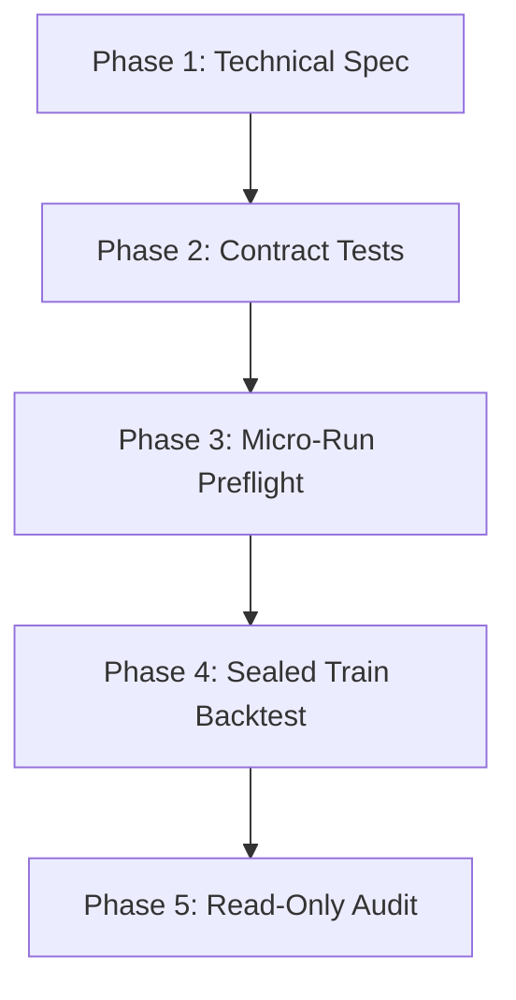

# FIRST BATCH EXECUTION PLAN V1

This document outlines the systematic, documentation-driven implementation and testing protocol for the pre-registered first batch strategies (`BO01`, `MR02`, `MR03`, `LS01`, `LS02`).

---

## 1. Implementation Phasing
Every pre-registered strategy must progress sequentially through the following 5 phases:



-   **Phase 1: Technical Specification:** Translate the pre-registration template into precise mathematical rules, indicator definitions, and timezone handling.
-   **Phase 2: Targeted Contract Tests:** Write targeted unit tests verifying no-lookahead features, TZ offsets, contract borders, and trade-trigger invariants in `03_RESEARCH_LAB/research_lab/tests`.
-   **Phase 3: Micro-Run Preflight:** Execute a fast 10-day dry-run to confirm that order entries, stops, limits, spreads, commissions, and telemetry log correctly.
-   **Phase 4: Sealed Train-Only Backtest:** Execute a one-shot, sealed run on train data (2015-2024) utilizing the official runner `research_lab.runners.formal_train_runner`.
-   **Phase 5: Read-Only External Audit:** Review the sealed dossiers under strict statistical gates, and update the strategy research registry.

---

## 2. Safe Parallelization Plan
To maintain absolute security and coordinate multiple agent actions safely without file collisions or git conflicts, the following multi-agent task routing matrix is established:

```mermaid
matrix
    [Agent A: Registry / Docs] --> Updates high-level registry & status taxonomy.
    [Agent B: Skeletons / Specs] --> Drafts technical specs and templates.
    [Agent C: Test Architect] --> Writes targeted contract unit tests.
    [Agent D: Implementer] --> Writes strategy python code (ONLY when owner approved).
    [Agent E: Auditor] --> Performs read-only quantitative audits.
```

### Strict Collaboration Rules:
1.  **Single Writer Lock:** Only one agent is allowed to modify the strategy scripts or run backtests at any given time. Multi-agent concurrent writing is strictly prohibited.
2.  **Explicit Branching:** Each strategy must have its own dedicated branch (e.g., `research/bo01-implementation-v1`, `audit/bo01-dossier-v1`) branching from the current audited commit.
3.  **No Direct Merges:** Merges or rebases to base or main branches are strictly forbidden. All integration must proceed through explicit owner pull requests.
4.  **No Heavy Commits:** Staging or committing heavy output files (trades, curves) is blocked. Only code, tests, configs, and light reports are permitted.
5.  **Data Vault Quarantine:** The `05_MARKET_DATA_VAULT` is read-only. No agent is allowed to write or modify raw price data under any circumstances.

---

## 3. Minimum Test Suite Requirements
Before any strategy is permitted to run a full backtest, the following unit tests must pass with 100% green status:
1.  `test_strategy_contract_[id].py`: Verifies that the strategy logic does not access future prices, out-of-bounds indicators, or out-of-schedule variables.
2.  `test_strategy_tz_[id].py`: Confirms correct timezone conversion, daylight saving transitions, and weekend gap handling.
3.  `test_strategy_fills_[id].py`: Checks order filling at bid/ask spreads, commission deductions, and stop-loss slippage markups.

---

## 4. Immediate Tasks
1.  **Stop:** The laboratory is currently locked. NO code writing or backtests are authorized under this planning phase.
2.  **Next step:** The owner must review this execution plan and the pre-registration dossier, select the first candidate to implement (e.g., `BO01`), and authorize its progression to Phase 1.
