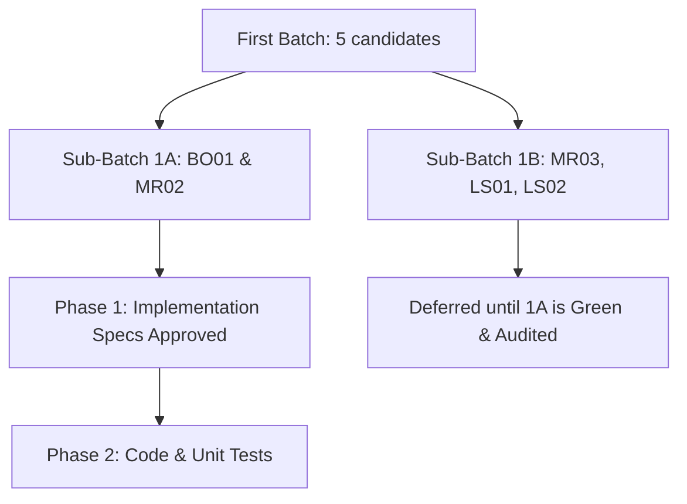

# FIRST BATCH SUB-BATCH DECISION V1

**Document Reference:** GOV-DEC-SUBBATCH-V1-20260517  
**Decision Status:** COMPLIANT  
**Date:** May 17, 2026  

---

## 1. Selected Routing Recommendation
To maximize laboratory safety, prevent concurrent file collisions, and ensure focused unit testing rigor, the Quant Architect Committee has decided to split the first batch of 5 pre-registered strategy candidates into two sequential sub-batches:

---

## 2. Details of Sub-Batching

### Sub-Batch 1A (Active Candidates)
1.  **`BO01`** (London Breakout Continuation) - Family: `LBC`
2.  **`MR02`** (London Breakout Failure) - Family: `LBF`

### Sub-Batch 1B (Deferred Candidates)
1.  **`MR03`** (NY Open Exhaustion Reversal) - Family: `NER`
2.  **`LS01`** (Prior Day High/Low Failed Auction) - Family: `DAF`
3.  **`LS02`** (Liquidity Alternative No-Manipulante) - Family: `LAN`

---

## 3. Rationale for Sub-Batching
1.  **Shared Feature Context:** Both `BO01` and `MR02` share the exact same pre-market feature set: the `Asian_High` and `Asian_Low` overnight anchors calculated on the M5 timeframe between 00:00 and 06:30 GMT. Implementing them together minimizes feature-engineering duplication and allows a unified timezone verification suite.
2.  **Complexity Control:** `MR03` requires daily VWAP anchors and M15 multi-timeframe calculations, while `LS01` and `LS02` require daily bars and H4 multi-day peaks/troughs. Restricting the initial scope to M5 intraday ranges prevents multi-timeframe alignment bugs.
3.  **Test Rigor:** Splitting the batch allows the test suite to focus heavily on verifying timezone daylight saving shifts (EST/EDT) on a single timeframe before adding complex, slower H4/Daily calculations.
4.  **No Parallel Conflict:** Prevents multiple agents from writing competing strategy files simultaneously, eliminating merge conflicts.

---

## 4. Required Progression Rules
*   Sub-Batch 1A must complete implementation/tests, implementation audit, micro-run approval, train-only owner approval, and post-run audit before Sub-Batch 1B implementation begins.

---
*End of Decision (GOV-DEC-SUBBATCH-V1-20260517)*
